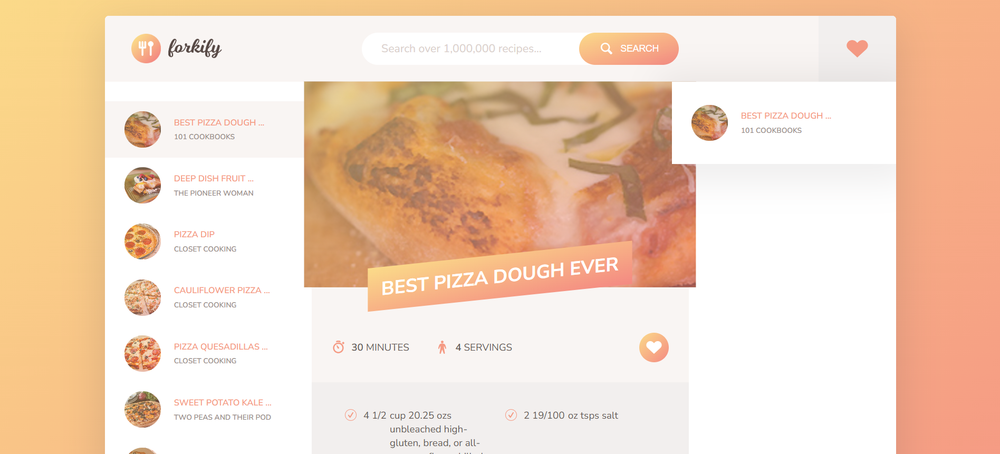
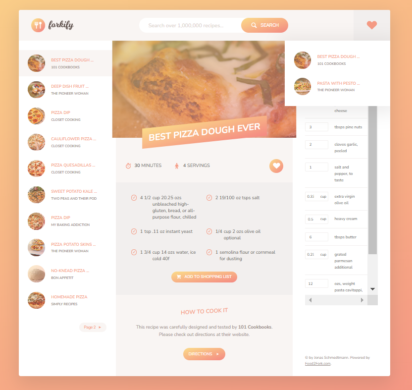

<div align="center">  
<h1 align="center">  
  
<br>Recipe Finder App</h1>  
<h3>Developed with the packages and tools below 🛠️</h3>  
<h3>HTML, CSS, JavaScript, Bable, WebPack, RestAPIs ⚙️</h3>  
<p align="center">  
  
  
  
  
  
  
</p>  
  
  
  

</div> 

# Overview  🍴

Welcome to the Recipe Finder App repository! This project demonstrates a web-based application designed to help users find and explore recipes efficiently. Below, you will find a detailed overview of the app's features, technologies, and setup instructions.


## Technologies Used 🛠️

- **Frontend**:
  - **HTML**, **CSS**, and **Vanilla JavaScript**
  - Responsive design principles for a mobile-friendly experience

- **Backend**:
  - **Node.js** for server-side logic
  - **RESTful APIs** for database interactions

- **Development Tools**:
  - **Babel** for JavaScript transpiring
  - **Webpack** for bundling and module management


## Demo 🎥

The demo video showcases the following functionalities:

1. **Search Recipes 🔎**: Input ingredients or keywords to fetch relevant recipes.
2. **Recipe Details 📝**: View detailed information about selected recipes, including ingredients and cooking instructions.
3. **Dynamic Updates 🔄**: The interface updates in real-time as users interact with the app.
4. **Saved Preferences ⭐**: Users returning to the webpage will see their previous preferences, offering a more tailored experience.

🎥 Watch the demo video below:

<div align="center">  
  <a href="https://youtu.be/t072AGryPq8">  
      
  </a>  
 <p>
  Click the image or [here](https://youtu.be/t072AGryPq8) to watch the video demonstration. 
 </p>
 
</div>  
🌐 Try the live app here: [Recipe Finder App](https://abu-taher-web.github.io/Recipe-Finder-App-GitHub-page/)


## Features 🌟

- **Web-Based Interface**: A clean and user-friendly interface for seamless navigation.
- **Dynamic Recipe Search 🔍**: Quickly find recipes using search functionality connected to a backend API.
- **Real-Time Data Retrieval 🌐**: Fetch and display recipe data dynamically from a backend database.
- **Responsive Design 📱**: The app is optimized for various screen sizes, ensuring accessibility on both desktop and mobile devices.
- **Cookies for User Preferences 🍪**: Automatically saves user preferences using cookies. Returning users will see their previously selected preferences for a personalized experience.
- **Bundled and Modular Codebase 📦**:
  - Utilizes Webpack for bundling dependencies and managing modules.
  - Supports modern JavaScript through Babel.

<div align="center">  
  
 <p>
  <i>Figure-1:</i> Full view of the UI with all features
 </p>
</div> 


---


## Project Folder Structure 📂

The project is organized as follows:

```
Recipe Finder App
   ├── css         # Contains compiled CSS files
   ├── img         # Stores images for the app
   ├── js          # Contains bundled JavaScript files
   └── index.html  # Entry point for the app (open this in your browser)

```

## Installation and Setup 🖥️

Follow these steps to set up the project locally:

1. **Clone the Repository**:
   ```bash
   git clone https://github.com/Abu-Taher-web/Recipe-App.git
   ```

2. **Navigate to the Project Directory**:
   ```bash
   cd Recipe-App
   ```

3. **Install Dependencies**:
   ```bash
   npm install
   ```

4. **Run the Application**:
   Open the `dist/index.html` file in your preferred browser to view the app.

5. Open your browser and navigate to `http://localhost:3000` to access the app.

---

## Future Enhancements 🚀

- **User Accounts**: Allow users to save favorite recipes and create custom meal plans.
- **Advanced Filtering**: Enable filters for dietary preferences, cuisines, and cooking times.
- **Offline Mode**: Integrate offline capabilities using service workers.


## Contributing 🤝

Contributions are welcome!


## License 📄

This project is licensed under the MIT License. See the [LICENSE](LICENSE) file for details.

---

